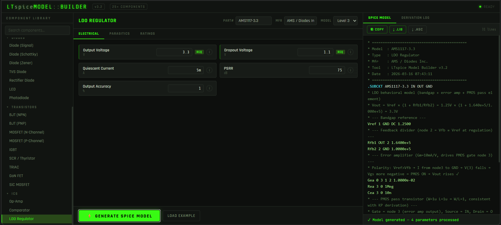
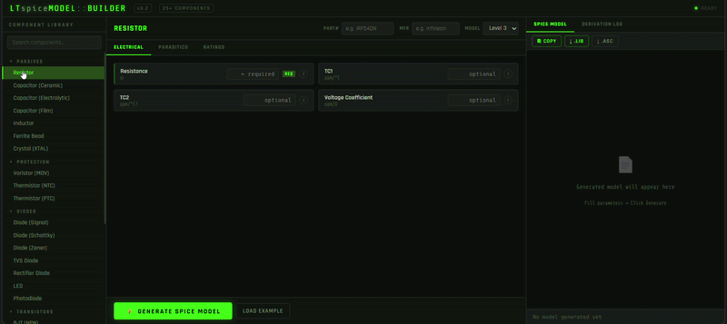

# LTspice Model Builder v3.2

> **Generate production-ready LTspice `.lib` models directly from datasheet parameters — no SPICE expertise required.**

A zero-dependency, single-file HTML tool that turns raw component datasheet numbers into accurate, simulation-ready SPICE netlists. Fill in what you know from the datasheet, click **Generate**, and get a verified `.lib` file you can drop straight into LTspice.

---

## ✨ Features

- **30+ component types** across five categories — passives, protection, diodes, transistors, and ICs
- **Physics-based parameter derivation** — KP from RDS(on)/Vgs/Vth, Is from Vf/If, ESL from SRF, crystal motional parameters from fs/Q/Rs, ferrite bead R/X decomposition, and more
- **Three output model strategies** — simple `.MODEL` statement, temperature-coefficient `.MODEL`, or full `.SUBCKT` with parasitics, depending on what you enter
- **Syntax-highlighted SPICE output** with keyword and value colouring
- **Generation log** with ✓ / ⚠ / ✗ pass/warn/error entries for every derived quantity
- **Validation strip** — missing required fields are caught before generation
- **Example loader** — pre-fills datasheet values for a real-world reference part per component
- **One-click export** — copy to clipboard, download as `.lib`, or download as `.asc` schematic wrapper
- **Searchable component tree** — filter components by name as you type
- **Zero dependencies** — one `.html` file, works offline, no build step, no npm

---

---

## 🗂 Supported Components

### Passives
| Component | Model Strategy |
|---|---|
| Resistor | Simple `R`, TC `.MODEL`, or `SUBCKT` with Ls/Cp parasitics |
| Capacitor (Ceramic) | `SUBCKT` ESL-ESR-C ladder; ESL auto-derived from SRF |
| Capacitor (Electrolytic) | `SUBCKT` ESL-ESR-C ladder with leakage resistance |
| Capacitor (Film) | `SUBCKT` ESL-ESR-C ladder |
| Inductor | `SUBCKT` DCR-Lmain-Rac ladder; Cp derived from SRF; Rac derived from Q |
| Ferrite Bead | `SUBCKT` Rdcr-Lfb-Rfb; R/X decomposed from Z@100MHz |
| Crystal (XTAL) | `SUBCKT` full Butterworth-Van Dyke (BVD) model; Lm/Cm derived from fs/Q/Rs; Co cross-checked against fp |

### Protection
| Component | Notes |
|---|---|
| Varistor (MOV) | Exponential V-I model |
| Thermistor (NTC) | B-parameter equation |
| Thermistor (PTC) | Resistance curve model |

### Diodes
| Component | Notes |
|---|---|
| Diode (Signal) | `.MODEL D`; Is auto-derived from Vf/If |
| Diode (Schottky) | `.MODEL D`; default N=1.05 |
| Diode (Zener) | `.MODEL D` with BV/IBV |
| TVS Diode | `.MODEL D` or bidirectional `SUBCKT` (two antiparallel diodes) |
| Rectifier Diode | `.MODEL D` with TT for reverse recovery |
| LED | `.MODEL D`; Is derived from Vf/If; default N=1.8 |
| Photodiode | `.MODEL D` with dark current |

### Transistors
| Component | Notes |
|---|---|
| BJT (NPN) | `.MODEL NPN`; all Gummel-Poon parameters |
| BJT (PNP) | `.MODEL PNP` |
| MOSFET (N-Channel) | Level 1 `.MODEL` or Level 3 `SUBCKT` with explicit Cgs/Cgd/Cds and body diode |
| MOSFET (P-Channel) | Level 1 `.MODEL` or Level 3 `SUBCKT`; Vth sign handled automatically |
| IGBT | `SUBCKT` using MOSFET + BJT pair approximation |
| SCR / Thyristor | Behavioural `SUBCKT` |
| TRIAC | Behavioural `SUBCKT` |
| GaN FET | `.SUBCKT` adapted for normally-off GaN behaviour |
| SiC MOSFET | `SUBCKT` with higher Vth defaults for SiC |

### ICs
| Component | Notes |
|---|---|
| Op-Amp | `SUBCKT` with GBW, slew rate, input offset, supply rails |
| Comparator | `SUBCKT` behavioural comparator with propagation delay |
| LDO Regulator | `SUBCKT` with dropout, PSRR, and output capacitor |

---

## 🚀 Usage

### Option A — Open locally
```
Double-click  ltspice_model_builder_v3_2.html
```
Works in any modern browser. No server, no installation.

### Option B — Host on GitHub Pages
1. Fork or clone this repo
2. Enable **GitHub Pages** (Settings → Pages → Deploy from `main` branch, `/ (root)`)
3. Access at `https://<your-username>.github.io/<repo-name>/ltspice_model_builder_v3_2.html`

---

## 🔧 Workflow

```
1. Search or click a component in the left panel
2. Enter Part Number and Manufacturer (optional, embedded in file header)
3. Choose Model Level (Level 1 = simple .MODEL, Level 3 = full SUBCKT)
4. Fill in parameters from the datasheet — REQ fields are mandatory
5. Hover the ⓘ button on any field for a tooltip explaining the parameter
6. Click  [ LOAD EXAMPLE ]  to see a real reference part pre-filled
7. Click  [ GENERATE MODEL ]
8. Review the SPICE output and the Generation Log tab
9. Copy to clipboard  or  Download .lib  or  Download .asc
```

---

## 📐 Physics Notes

The tool applies real SPICE physics throughout, not heuristics:

| Derivation | Formula |
|---|---|
| MOSFET KP from RDS(on) | `KP = 1 / (RDS(on) × (Vgs − Vth))` — valid in deep triode region |
| Diode Is from Vf/If | `Is = If / (exp(Vf / (N × Vt)) − 1)` where Vt = 25.85 mV @ 300 K |
| Crystal Lm | `Lm = (Rs × Q) / (2π × fs)` |
| Crystal Cm | `Cm = 1 / ((2π × fs)² × Lm)` |
| ESL from SRF | `ESL = 1 / ((2π × SRF)² × C)` |
| Inductor Cp from SRF | `Cp = 1 / ((2π × SRF)² × L)` |
| Inductor Rac from Q | `Rac = (2π × ftest × L) / Q` |
| Body diode Is from Vf | Uses N = 1.5 (typical Si PN), 1 A test point |
| Crystal Co from fp | `Co = Cm / ((fp/fs)² − 1)` with mismatch warning |

The MOSFET level-3 subcircuit places Cgs/Cgd/Cds as **explicit capacitor elements** rather than CGSO/CGDO model parameters (which are per-unit-width F/m and meaningless for discrete parts).

---

## 📄 Output Format

Every generated model includes a standard file header:

```spice
* ============================================
* Model  : IRF540N
* Type   : MOSFET (N-Channel)
* Mfr    : Vishay
* Tool   : LTspice Model Builder v3.2
* Date   : 2026-03-16 14:22:05
* ============================================
```

Followed by the `.MODEL` or `.SUBCKT` block and a `* Usage:` comment showing how to instantiate the component in a schematic.

---

---

## 📋 Requirements

| Requirement | Detail |
|---|---|
| Browser | Any modern browser (Chrome, Firefox, Edge, Safari) |
| Internet | Only needed to load Google Fonts (cosmetic — works offline without them) |
| LTspice | XVII or LTspice 24 to use the generated `.lib` files |

---

## 🤝 Contributing

Contributions welcome. Useful directions:

- **New component types** — add entry to `COMPONENTS`, `PARAMS`, `EXAMPLES`, and `routeGenerate()`
- **Parameter corrections** — if a physics equation is wrong, open an issue with the correct formula and source reference
- **Dark/light theme toggle**
- **Import from clipboard** — paste a raw `.lib` and back-fill the form fields

Please open an issue before starting large changes.

---

## 📜 License

MIT License. See (LICENSE) for details.

---

## 🙏 Acknowledgements

Built for hardware engineers who spend too much time hand-writing SPICE parameters from datasheets. The MOSFET KP derivation correction, body diode ideality fix, and ESL/SRF cross-derivation logic were refined through multiple real-simulation verification passes.

---

*Generated models are approximations derived from datasheet specifications. Always verify simulation results against bench measurements for critical designs.*
